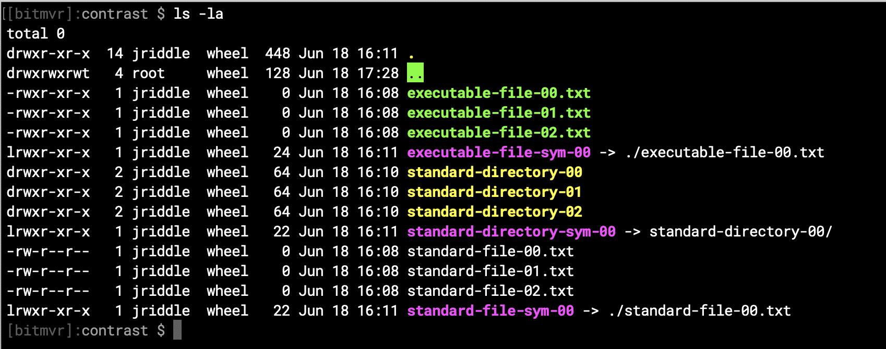

# contrast

A high contrast color scheme for your MacOS Terminal




## Installation

### Applying the Configuration to the `.bash_profile`

Open the `.bash_profile` and add apply following configuration.

```
# Contrast Configuration: Enable Color
export CLICOLOR=1

# Contrast Configuration: Enable Color
export LSCOLORS=DxFxCxDxCxegedabagaced

# Contrast PS1 Configuration
export PS1="\\033[38;5;237m[\u]:\\033[38;5;245m\W \$\\033[0m "
```

> **Note:** If you already have LSCOLORS defined, comment out or replace yours with the character set above

Refresh the `.bash_profile`

```
source $HOME/.bash_profile
```

### Configure **Terminal** Preferences

You can open the Termina's preferences by doing the following:

1. **Select** `Terminal` from the header navigation
2. **Select** `Preferences`

> **Note:** Follow these directions when needing to update the `Hex Color #` in later steps.
> - **Click** the color swatch.
> - **Click** the **Color Sliders** icon
> - **Locate** the text `Hex Color #`
> - **Enter** the corresponding code values from the tables below

#### Configuring the Font

`Roboto Mono 12 pt.`

#### Configuring the Text 
 - [x] Antialias text
 - [x] Use bold fonts
 - [x] Allow blinking text
 - [x] Display ANSI colors
 - [ ] Use bright colors for bold text

|  | Hex Color # | 
|---|-------|
| Text | `ffffff` | 
| Bold | `ffffff` | 
| Selection | `555555` | 


#### Configuring the ANSI Colors

|  | Black | Red | Green | Yellow | Blue | Magenta | Cyan | White |
|---|-------|-----|-------|--------|------|---------|------|-------|
| Normal | `000000` | `FF0000` | `66FF00` | `FFFF00` | `0000FF` | `FF00FF` | `00FFFF` | `FFFFFF` | 
| Bright | `666666` | `FF0000` | `66FF00` | `FFFF00` | `0000FF` | `FF00FF` | `00FFFF` | `FFFFFF` | 


